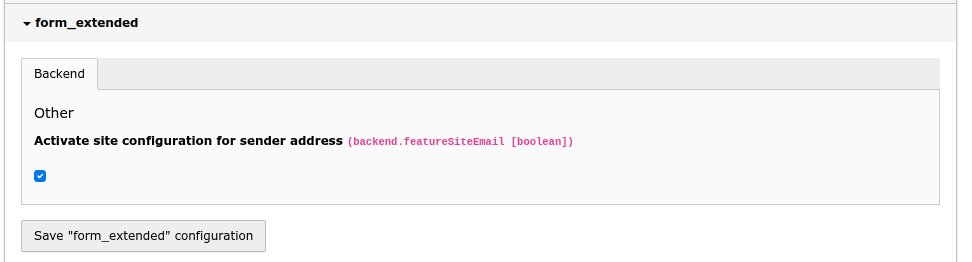
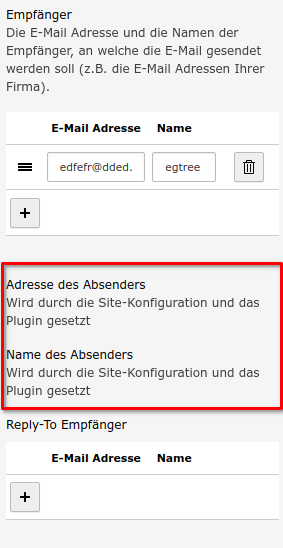
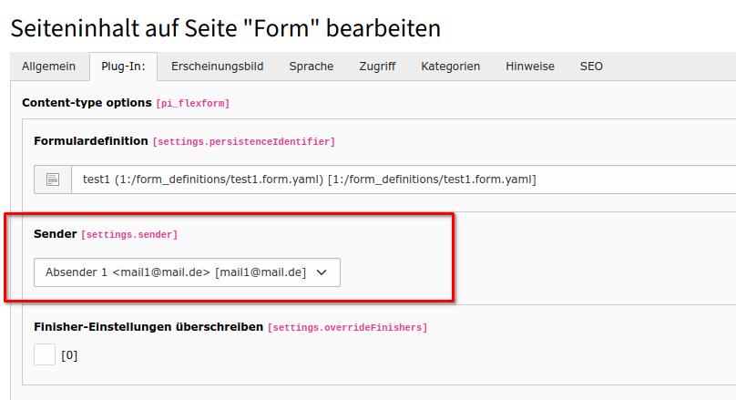
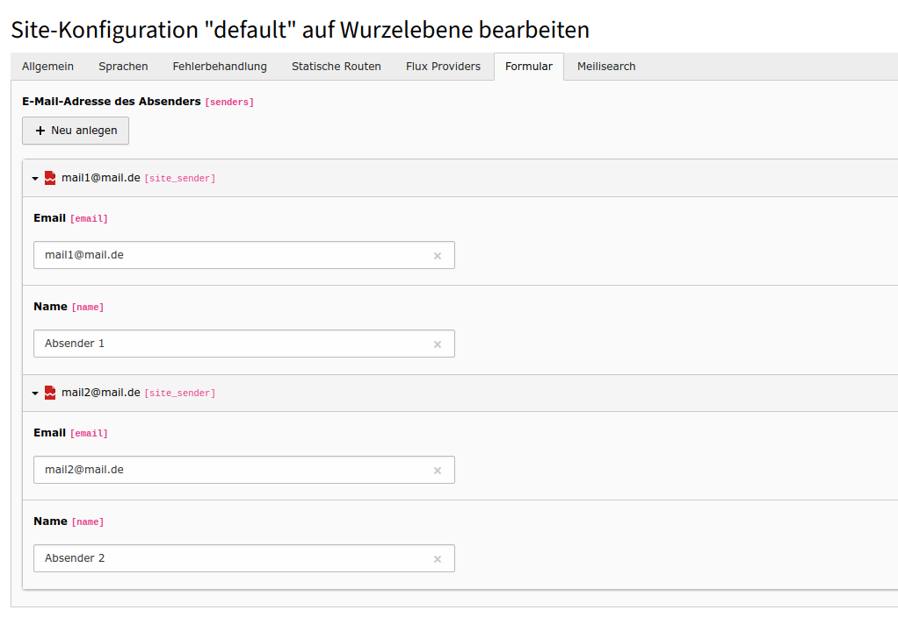

# form_extended

## What does it do?

It extends the form extension with the following features:

- Double opt-in controller + finisher for realising a registration process
- country select box by using static_info_tables
- CopyToSenderEmailFinisher:
- Multiple file upload support
  
- Privacy policy checkbox: Set ID of policy page
- New property fields:
  - info
  - hide title
  - hide in receiver mail
  - hide in sender mail
- Registration functions
  - extendable alternative to sf-regater
  - Double Opt-In
  - fully integrated with form
  - design flexibility
  - add your own fields
  - spam protection
  - extendable with typical form methods like YAML

### Feature: Set senders in site configuration

With the sender-in-site feature, administrators can define valid senders in the site configuration and editors can select them in the plugins.

It is no longer possible to set the sender manually.

